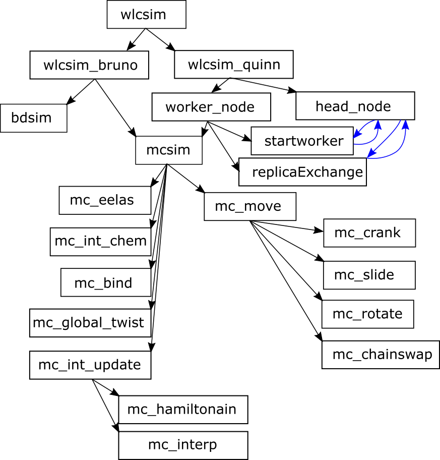
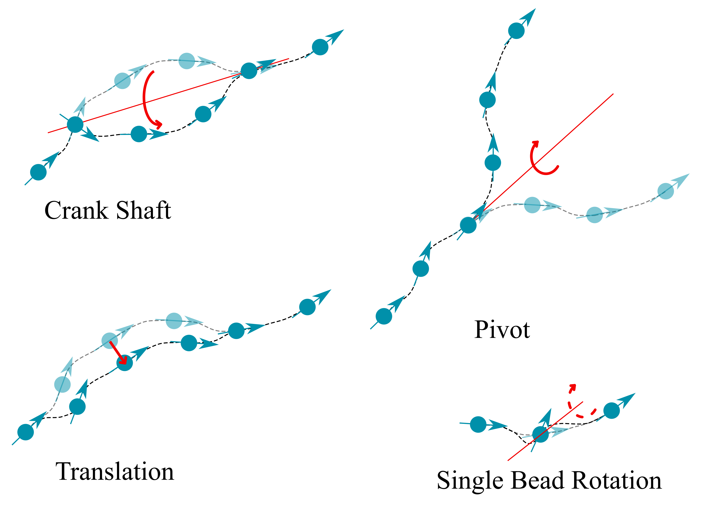
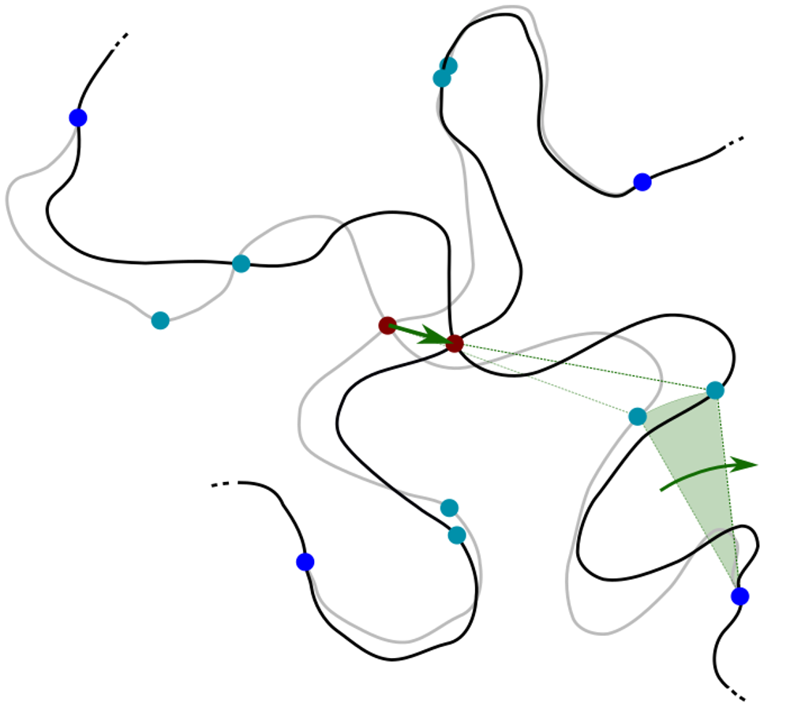

.. _wlcsimf:

wlcsim Fortran Codebase Structure
#################################

.. f:program:: wlcsim

    Use a universal discretization scheme to simulate from WLCs through
    Gaussian chains.

The main entry point of the program is pretty useless as a starting point to
understand the codebase, and simply calls one of several "versions" of the
program built from our Brownian Dynamics/Monte Carlo API.

.. f:autosrcfile:: wlcsim.f03

The actual hard work is done in the `wlcsim_*` files

.. f:autosrcfile:: wlcsim_bruno.f03

.. f:autosubroutine:: wlcsim_quinn 

The main entry points for our API are the `mcsim.f03` and `BDsim.f03` routines,
which allow you to do Monte Carlo moves and Brownian Dynamics timesteps
(respectively) given a set of energies (or forces, respectively) specified by
the input in `defines.inc`.

.. f:autosrcfile:: mcsim.f03

`mcsim.f03` calls different subroutines that define possible Monte Carlo moves
(like `MC_reptationMove.f03`) and then checks for whether the move should
succeed by summing the various energies that are turned on (like `mc_wlc.f90`).
Diagrams describing a few of the moves are provided here:

:ref:`MC_wlc`

Paramters of moves are optimized over time by `adapt.f90`.

.. f:autosrcfile:: adapt.f90

